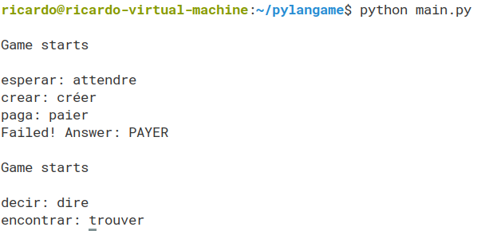

# pylangame
Game to learn vocabulary in any language using Google Translator API




## Options

- *dict_name* - Path of the words file. One word per line. Example: "dictionary.txt"

- *dict_lang* - Language of the word file indicated in variable dict_name. Example: "en"

- *qust_lang* - Language used to ask. Use it if the dictionary is not in your native language. Example: "es"

- *transl_to* - Language used to answer. Example: "fr"

- *randomize* - Randomize word order or not. Example: "y"

- *restart_f* - Restart after failure or not. Example: "y"


## Requirements

Python 2.x:

```
pip install googletrans
```

Python 3.x:

```
pip3 install googletrans
```

# Note 

Tested both in Python2.x (2.7.15rc1) and Python 3.x (3.6.7)
